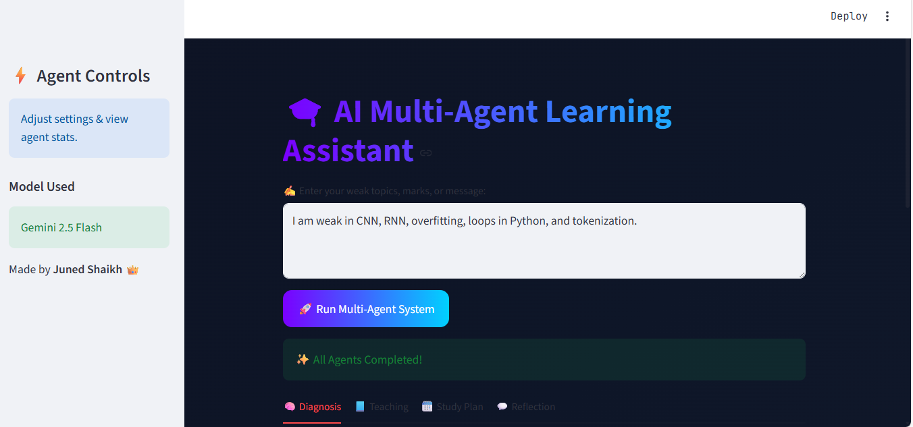
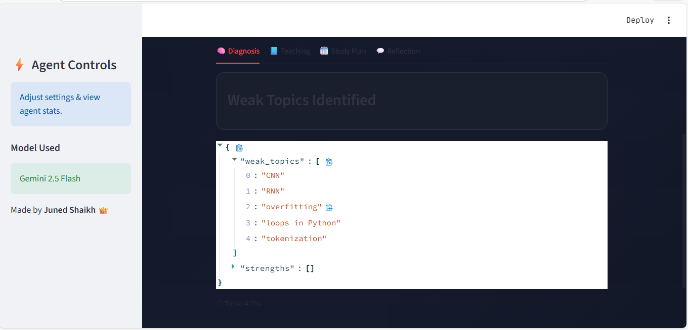
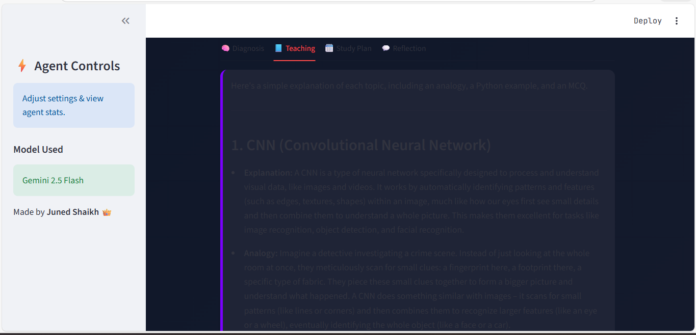
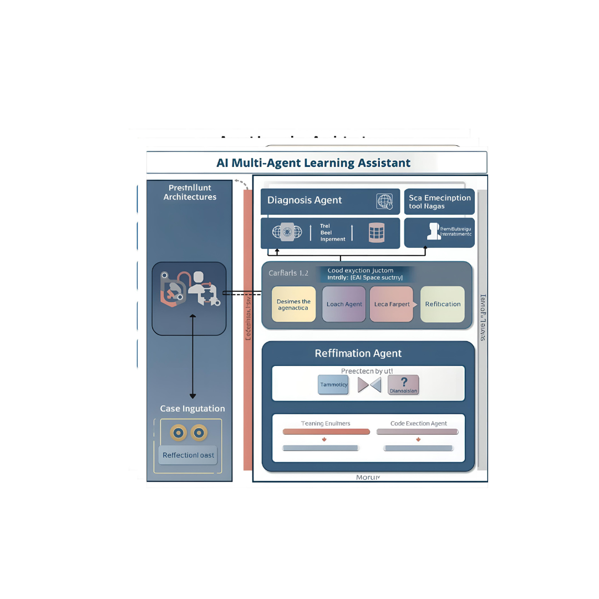

# ai-multi-agent-learning-assistant
Multi-Agent AI Learning Assistant for Students using Gemini 2.5 Flash.

# 🎓 AI Multi-Agent Learning Assistant  
### Powered by Gemini 2.5 Flash + Streamlit  
A smart educational multi-agent system that diagnoses weak topics, teaches concepts with examples, generates a personalized study plan, and gives reflective improvements with motivation.

---

## 📌 Overview  
This project is created for the **Kaggle Agents Intensive Capstone – Agents for Good Track**.  
It uses a **4-agent pipeline** backed by **Gemini 2.5 Flash** to help learners understand difficult topics through adaptive learning.

---

## 🏗️ Architecture Diagram

<p align="center">
  
</p>

---

## 🧩 Multi-Agent Pipeline

```
User Input
   ↓
Diagnosis Agent
   ↓
Teaching Agent
   ↓
Study Planner Agent
   ↓
Reflection Agent
   ↓
Streamlit UI Output
```

Each agent focuses on a dedicated task for accuracy and clarity.

---

## ✨ Features

### ✔ Multi-Agent System
- **Diagnosis Agent:** Extracts weak topics  
- **Teaching Agent:** Explanations + analogies + examples + MCQs  
- **Study Planner Agent:** 7-day personalized plan  
- **Reflection Agent:** Improvements + motivation + score estimation  

### ✔ Modern Streamlit UI
- Gradient neon headers  
- ChatGPT-style output bubbles  
- Sidebar with model info  
- Smooth animations  
- Tabs with icons  
- Card layouts  

### ✔ Tools Used
- JSON Cleaner  
- Code Execution Tool  
- Score Prediction Tool  

### ✔ Observability
- Execution time logs  
- Error-safe design  
- Clean structured output  

---

## 🖥️ UI Screenshots  

### 🟦 Home Screen  
<p align="center">
  
</p>

### 🟪 Diagnosis Output  
<p align="center">
  
</p>

### 🟦 Teaching Output  
<p align="center">
  
</p>

### 🟩 Study Plan Output  
<p align="center">
  
</p>

### 🟥 Reflection Output  
<p align="center">
  
</p>

### 🟥 Architecture
<p align="center">
  
</p>
---

## 🔧 Installation

### 1️⃣ Clone the repo
```bash
git clone https://github.com/YOUR_USERNAME/ai-multi-agent-learning-assistant.git
cd ai-multi-agent-learning-assistant
```

### 2️⃣ Install dependencies
```bash
pip install -r requirements.txt
```

### 3️⃣ Set API Key

**Windows PowerShell**
```powershell
$env:GEMINI_API_KEY="YOUR_KEY"
```

**Mac/Linux**
```bash
export GEMINI_API_KEY="YOUR_KEY"
```

---

## 🚀 Run the App

```
streamlit run ui.py
```

---

## 🧠 Agent Breakdown

### 🧠 Diagnosis Agent  
Identifies weak topics using structured extraction.

### 📘 Teaching Agent  
Generates:
- Concept explanation  
- Analogy  
- Python example  
- MCQ with answer  

### 🗓️ Study Planner Agent  
Creates a 7-day study plan with focus + revision.

### 💬 Reflection Agent  
Improves plan and gives motivational advice.

---

## ⚙️ Technologies Used
- Python  
- Streamlit  
- Gemini 2.5 Flash  
- Multi-Agent Architecture  
- Custom CSS Enhancements  

---

## 📂 Project Structure

```
/
│── ai_agent.py
│── ui.py
│── requirements.txt
│── README.md
│── screenshots/
└── .streamlit/
       └── config.toml
```

---

## 🎬 Demo Video  
Add your final YouTube link here:

```
https://youtube.com/your-video
```

---

## 📄 Presentation  
`AI-Multi-Agent-Learning-Assistant.pptx`

---

## 🙌 Author  
**Juned Shaikh**  
B.Tech — Artificial Intelligence & Data Science  
DBATU University  

---

## ⭐ Support  
If you like this project, please ⭐ star the repo!

